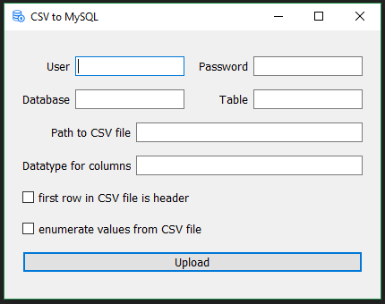

# Python-CSV-to-MySQL
A python script, with a GUI interface, that loads values from a CSV file into a MySQL server on localhost.



## Dependencies

- MySQLdb
- PyQt5

## Instalation

&nbsp;&nbsp;&nbsp;&nbsp;&nbsp;&nbsp; **1\)** Make sure you have Python 3.6 or later installed, you can grab it over [here](https://www.python.org/downloads/)

&nbsp;&nbsp;&nbsp;&nbsp;&nbsp;&nbsp; **2\.a)** You can just download this repository
  
&nbsp;&nbsp;&nbsp;&nbsp;&nbsp;&nbsp; **2\.b)** Or if you use git you can clone the repository using ``` git clone https://github.com/mikister/Python-CSV-to-MySQL.git ```

&nbsp;&nbsp;&nbsp;&nbsp;&nbsp;&nbsp; **3\)** Enter into the repository and open in terminal in it

&nbsp;&nbsp;&nbsp;&nbsp;&nbsp;&nbsp; **4\)** Run ``` pip install -r requirements.txt ``` This will install the all needed dependencies. If it is not working and is showing
  permission denied error, then try ``` sudo pip install -r requirements.txt ```.

## Using CSV to MySQL

- Just run the ```gui.py``` file
